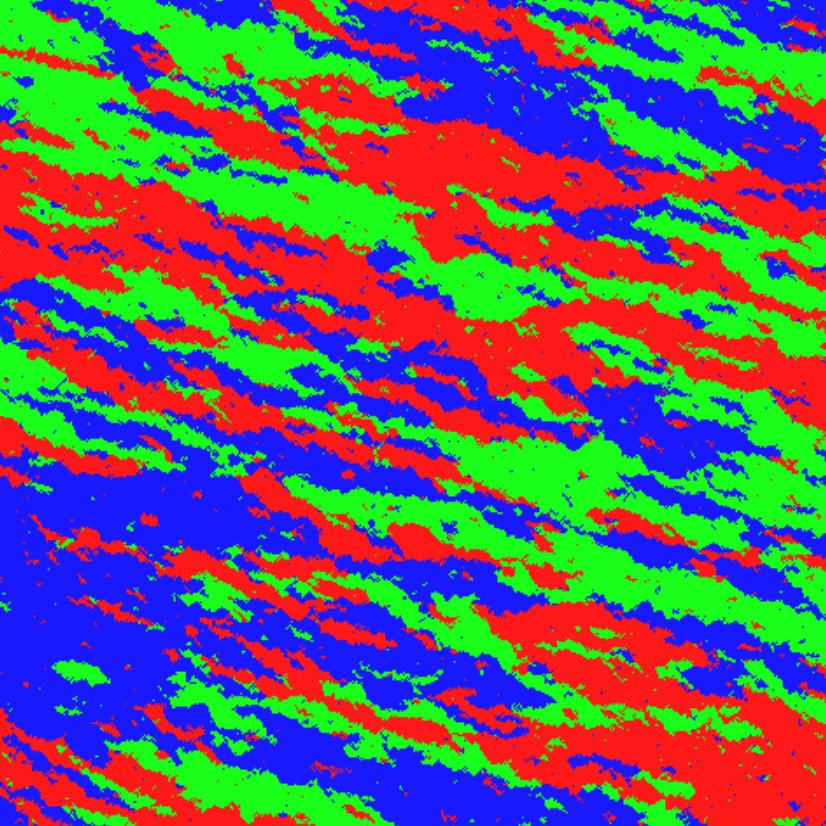
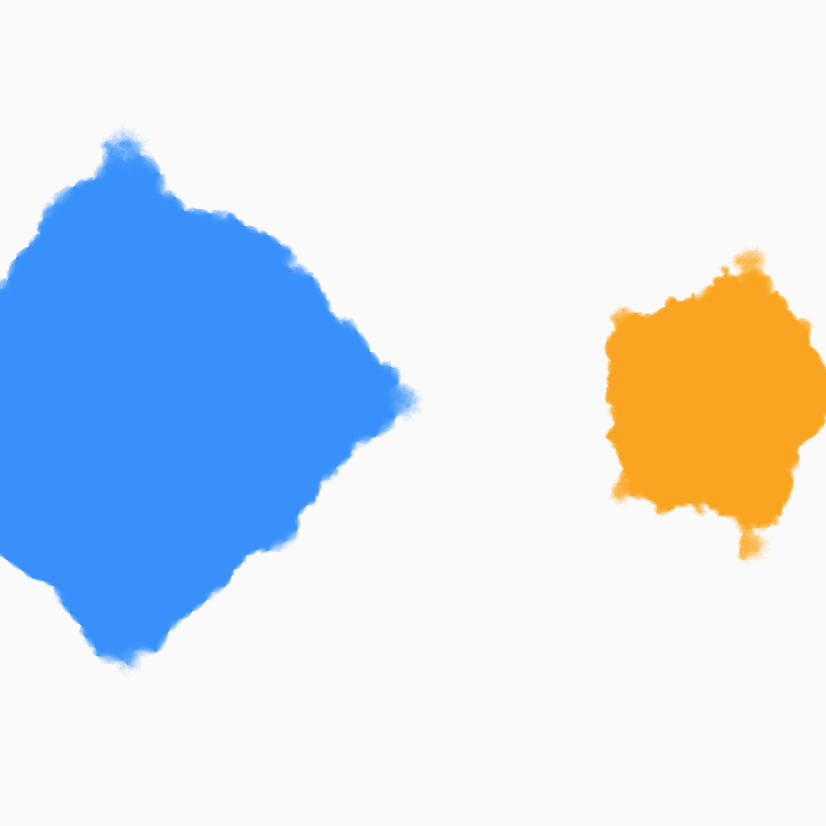
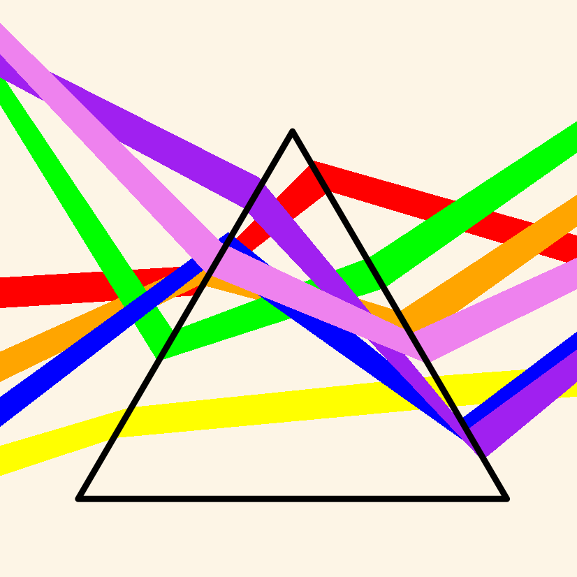
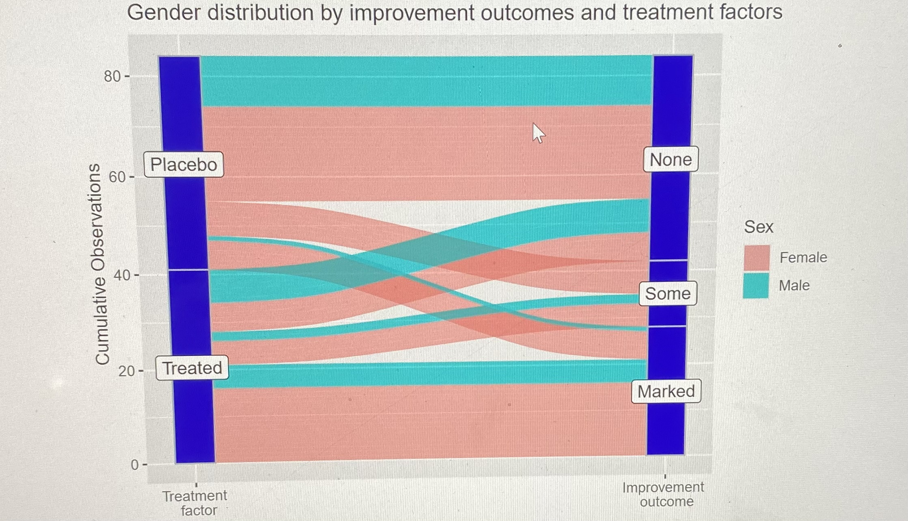
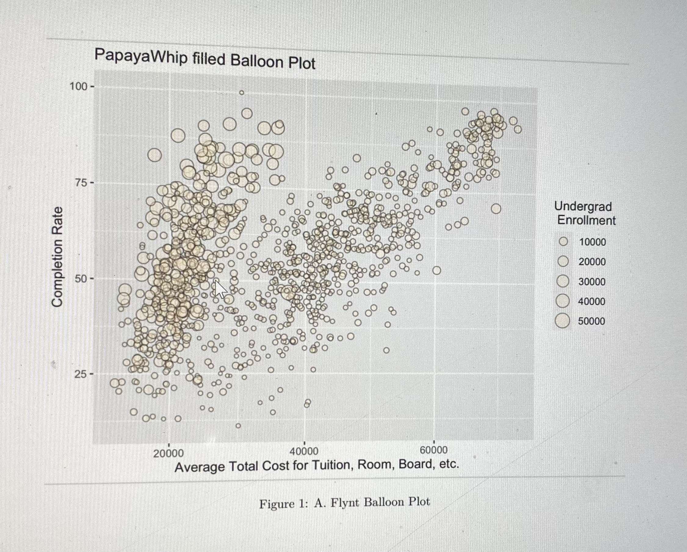
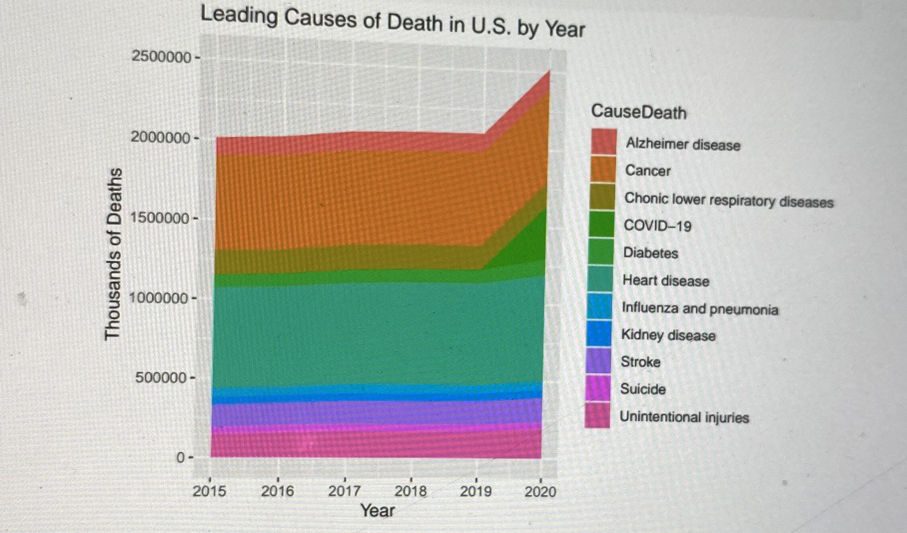

 
This page will focus on my prior works done in MATH 230. These include some pieces of generative artwork, screenshots of some project functionalities, as well as just some of my favorite visualizations we've seen from in the semester.

#### Generative Artwork

{#id .class width=70% height=70%}

{#id .class width=70% height=70%}

{#id .class width=70% height=70%}

## Past Projects

#### Confidence Interval Project

.png){#id .class width=70% height=70%}

[Link to Interactive Version](https://rconnect.bucknell.edu/content/2c3f0336-668a-46c0-ab93-036e915446c4)

Our interactive confidence interval project. This does not draw data from anywhere, but rather generates its own and creates confidence intervals based on the specified normal distribution.

#### GGplot extensions project 

{#id .class width=70% height=70%}

The data set used here was for a clinical drug trial, where the colors of each band refer to the subjects gender, and we see whether or not there was no, some, or marked improvement from what kind of treatment said individual recieved, whether that be placebo or the actual treatment. 

#### My favorite 2 pieces from this semester

{#id .class width=70% height=70%}

This plot takes a look at college data and graphs undergrad enrollment. It differs from a normal scatter plot in that the size of each point has significant meaning. This essentially adds a 3rd dimension to this graph, where the x axis represents tuition cost and the y axis representing graduation rate 

{#id .class width=70% height=70%}

This plot shows the leading causes of death per year by using area as a quantitative measure. The x axis represents time, in years, while the y axis represents thousands of deaths. It is unique in that no matter where we are looking verticaly, the value of any cause of death is determined only by the thickness of its respective color, rather than its height on traditional y axes.
